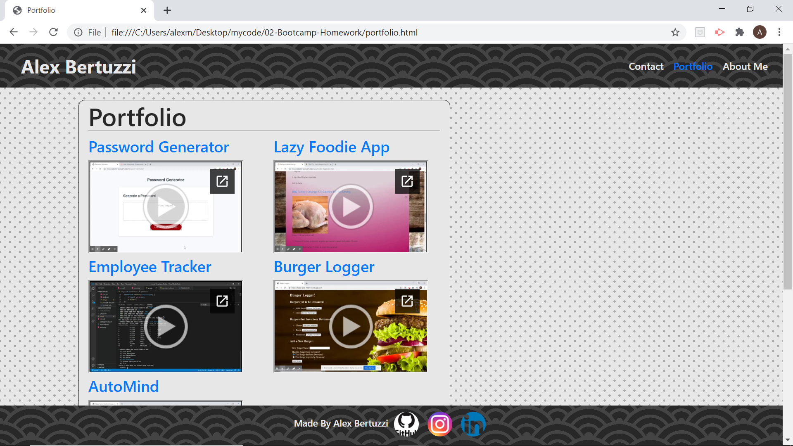

# Personal-Portfolio
This is my Personal Portfolio where I will be providing links to some of my best work and most complex projects.

In this project I used react with bootstrap to create a website with five components: Header, AboutMe, Contact, Portfolio, and Footer.

All five components utilize the bootstrap frame work of collums and rows with bootstrap css and javascrip links.

There is a style.css page that I used to define the basic styling and placement of content uniformaly.

The website is resposive with multiple breakpoints.

The contact component includes a working form that sends an email to my personal email address utilizing "formspree.io."

The portfolio component is formatted to give links to my various projects on github. The portfolio component has Project Previews with a link to a few of the projects I have uploaded including: Password Generator, Lazy Foodie App, Emplloyee Tracker, Burger Logger, AutoMind, Online-Offline-Budget-Tracker.

Checkout the Deployed Application here: https://alexbertuzzi-reactportfolio.herokuapp.com/

